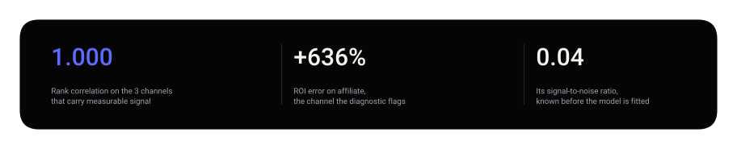
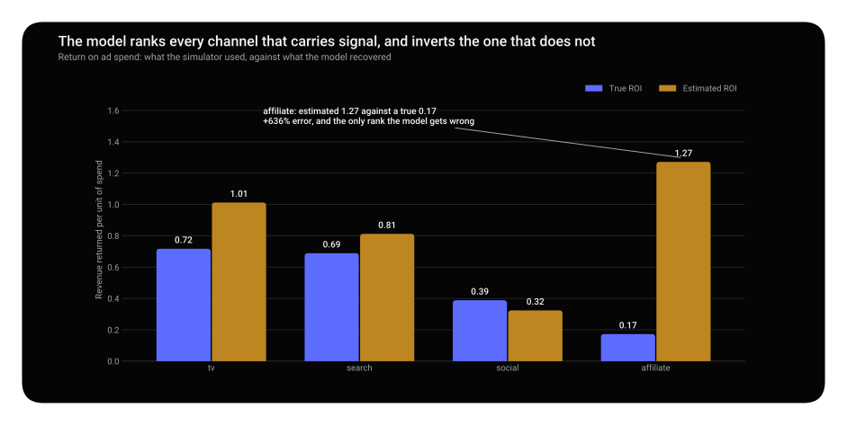
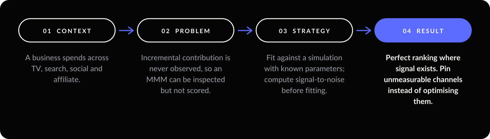
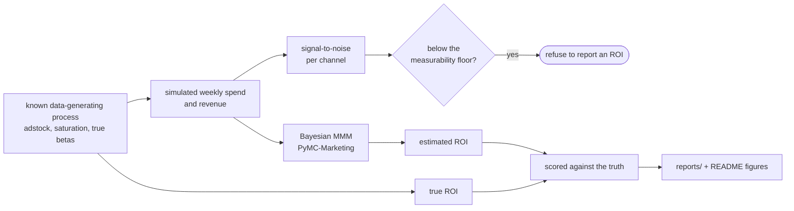
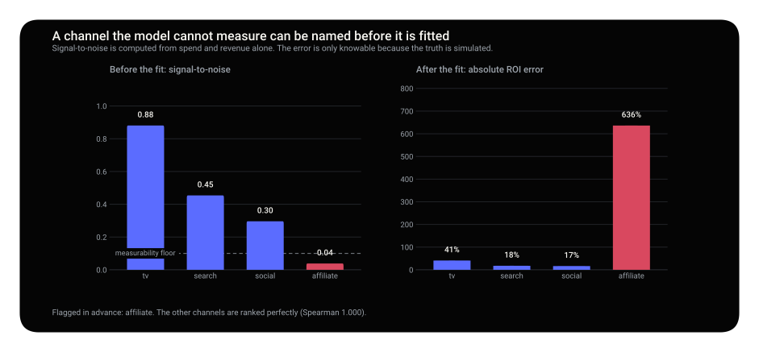
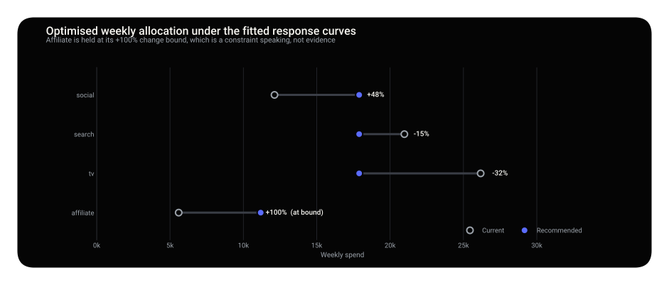
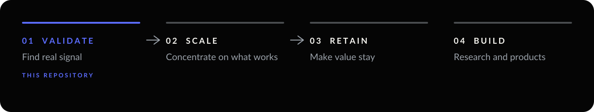

<p align="center"></p>

<p align="center">
  
  
  
  
</p>

**An MMM is usually admired, not scored. This one is fitted against a process whose answers are
written down.** It ranks every channel that carries signal perfectly. It fails on the one that does
not, and a diagnostic computed before fitting says which one that is.

<p align="center"></p>

<p align="center"></p>

> **Decision.** Compute signal-to-noise per channel before trusting any MMM, and refuse to report an ROI for channels below the measurability floor rather than reporting a confident wrong one.

<details>
<summary><b>What is in this repository</b></summary>

| | |
| --- | --- |
| **The question** | How much revenue did each channel actually cause — and can an MMM be trusted to say? |
| **The data** | SIMULATED from a known data-generating process. On real data an MMM cannot be scored, because the true answer is unknown. Here it is written down. |
| **The method** | Bayesian MMM with adstock and saturation (PyMC-Marketing), scored against the truth, plus a pre-fit diagnostic. |
| **The finding** | Perfect ranking where signal exists; a 636% error where it does not — and the diagnostic names which is which before fitting. |

```
src/mmm/    the simulator (the known truth), the model, the config, figures
reports/    fitted results: ROI recovery, signal-to-noise, budget allocation
tests/      that the simulator is reproducible and the model recovers what it should
```

</details>

<p align="center"></p>

---

## 01 — Context

A business spends across TV, search, social and affiliate, and wants to know how much revenue each
channel actually caused, so the next unit of budget goes to the right place.

### Data

**SIMULATED, deliberately. No real company's data appears in this repository.** The generating process
lives in [`src/mmm/config.py`](src/mmm/config.py).

| | |
| --- | --- |
| Period | 104 weeks, weekly |
| Channels | tv, search, social, affiliate |
| Media share of revenue | 44%; the rest is baseline the model must not claim |
| Baseline | intercept + linear trend + yearly seasonality + Gaussian noise |

The model receives only what a client's data team can hand over: dates, weekly spend per channel and
weekly revenue. The baseline carries trend and seasonality on purpose. Without them, a model that
credits the season to whichever channel spent during it would still look accurate.

---

## 02 — Problem

Incremental contribution is never observed. On real data an MMM's output can be inspected but not
scored: everyone sees the same decomposition chart, and nobody can say whether it is right.

---

## 03 — Strategy

| Decision | Why |
| --- | --- |
| **Known ground truth** | Estimates are checked against an answer key, not against intuition. |
| **Geometric adstock, then logistic saturation** | Matches the simulation, so recovery measures estimation quality, not specification error. |
| **Yearly seasonality in the model** | Omitting it is the most common way an MMM flatters a channel. |
| **Signal-to-noise before fitting** | Is there enough signal for the model to say anything, or will it return the prior dressed as a finding? |
| **Rank correlation** | The decision is where the next pound goes, so the ordering is what has to survive. |
| **Bounded optimisation (40%–200%)** | Saturation curves are least trustworthy where no data was observed. |

```
adstock(spend, alpha)   carryover: each week keeps a decaying share of earlier spend
saturation(x, lambda)   (1 - exp(-lambda*x)) / (1 + exp(-lambda*x))
contribution            beta * saturation(adstock(spend))
ROI                     incremental contribution / spend
signal_to_noise         sd(weekly contribution) / sd(weekly revenue noise)
```



---

## 04 — Result


| Channel | True ROI | Estimated ROI | Error | True rank | Estimated rank |
| --- | --- | --- | --- | --- | --- |
| tv | 0.717 | 1.012 | +41.2% | 1 | 2 |
| search | 0.689 | 0.812 | +17.9% | 2 | 3 |
| social | 0.389 | 0.324 | −16.7% | 3 | 4 |
| **affiliate** | **0.173** | **1.271** | **+636.5%** | **4** | **1** |

Read in aggregate, the model looks broken: rank correlation **−0.200**, and the worst channel ranked
first. **Drop the one channel it could never have measured and the picture inverts:**

| | Including affiliate | Excluding affiliate |
| --- | --- | --- |
| ROI rank correlation | −0.200 | **1.000** |
| Mean absolute ROI error | 0.396 | **0.161** |

Affiliate is 1.2% of revenue, and its weekly contribution varies by about 4% of the revenue noise. The
model returns something close to its prior, with the same confident interval as everything else.

**What the error costs.** Fed into the optimiser, the fitted model **doubles spend on the worst
channel** (+100%, stopped only by the cap) and cuts TV by 31.6%. The machinery works correctly; it is
fed one number it should never have been given.

**The sampler tells the same story.** The default `target_accept` produced 93 divergences, and 0.95
cut them to 22. An unidentified parameter leaves a flat ridge in the posterior that NUTS cannot
traverse. **The divergences and the 636% error have the same cause.**

> **Decision.** Compute signal-to-noise per channel before trusting any MMM. Pin channels below about
> 0.1 to current spend and leave them out of the optimisation. Measure them with a geo experiment or
> a holdout, not with a bigger model.

---

<p align="center"></p>

<p align="center"></p>

---

## 05 — Limits and next move

- **Simulated data.** What transfers is the method and the diagnostic, not the numbers.
- **The model knows the right functional form.** This is an optimistic floor. Real campaigns do not
  come with their functional form attached.
- **25% average ROI error on identifiable channels** is enough to rank and size a reallocation, not to
  defend "TV returns exactly 0.72".
- **Correlation is not causation, even here.** Only a geo holdout or a randomised experiment separates
  cause from timing. See [ab-testing-toolkit](https://github.com/arielabade/ab-testing-toolkit).
- **Next move:** rerun the recovery with a mis-specified saturation curve, and split the 25% error into
  estimation and specification.

---

## Run it

```bash
git clone https://github.com/arielabade/marketing-mix-modeling
cd marketing-mix-modeling
python -m venv .venv && source .venv/bin/activate
pip install -e ".[dev]"

python run_fit.py        # simulate, fit, and score recovery against the truth
python run_optimise.py   # reallocate the budget using the fitted curves
pytest                   # 13 tests
```

Sampling takes several minutes: four chains, 2,000 tuning steps, `target_accept = 0.95`.

## Repository map

```
src/mmm/config.py     the known generating process and the optimisation bounds
src/mmm/simulate.py   adstock, saturation, and the dataset
src/mmm/model.py      the MMM, ROI recovery, signal-to-noise, budget optimisation
tests/                adstock and saturation properties, and the diagnostic
reports/              roi_recovery.csv, signal_to_noise.csv, budget_allocation.csv
notebooks/            recovery exploration
```

---

<p align="center"></p>

<p align="center">
  <a href="https://github.com/arielabade/ab-testing-toolkit">← Prove causation with an experiment</a> &nbsp;·&nbsp;
  <a href="https://github.com/arielabade">Portfolio</a> &nbsp;·&nbsp;
  <a href="https://github.com/arielabade/unit-economics-olist">Price the channels →</a>
</p>
